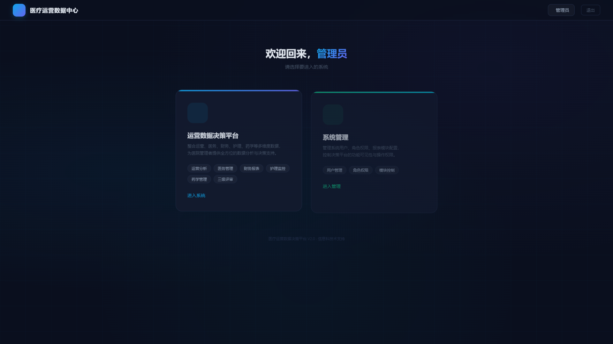
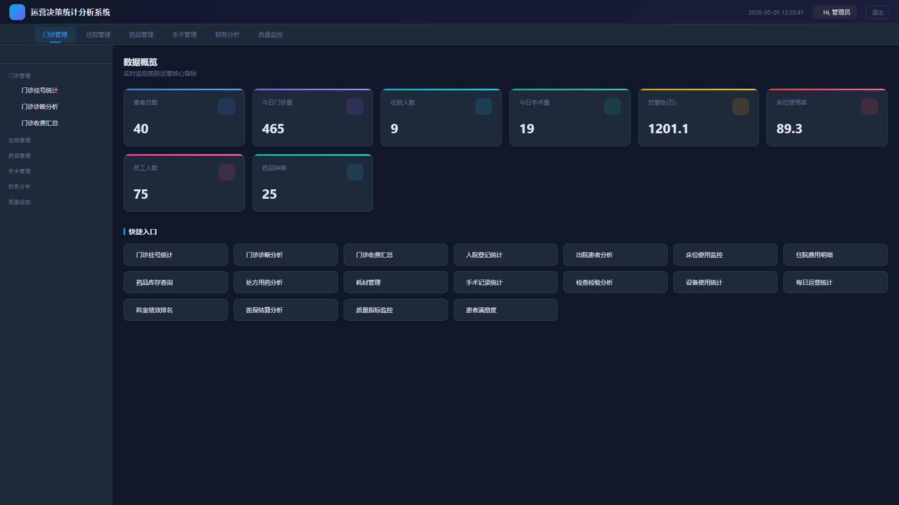
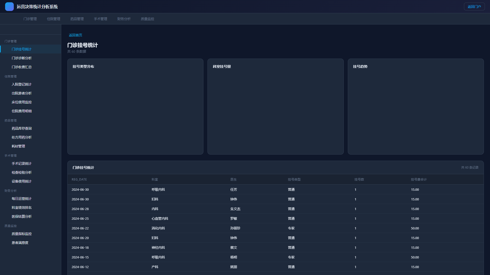
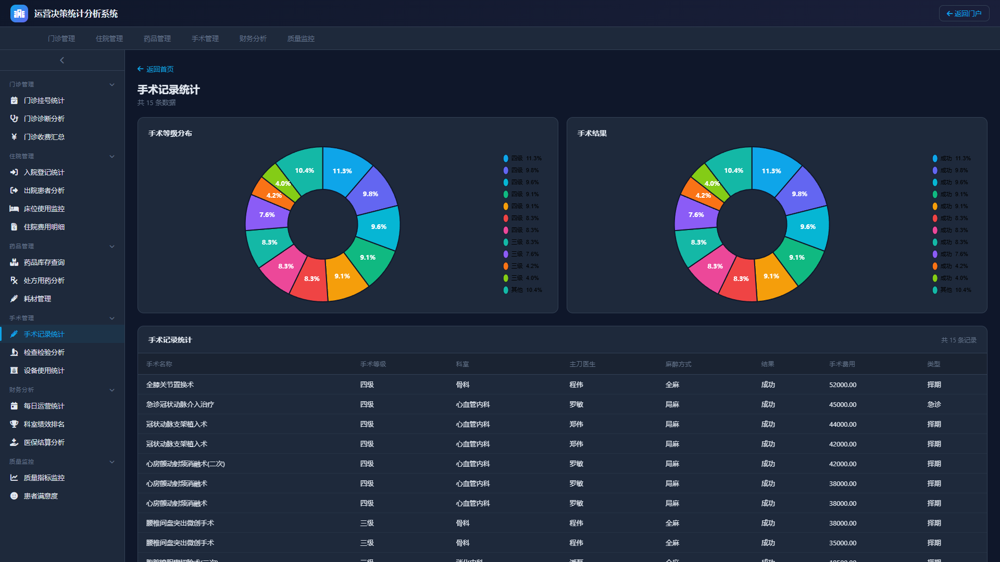
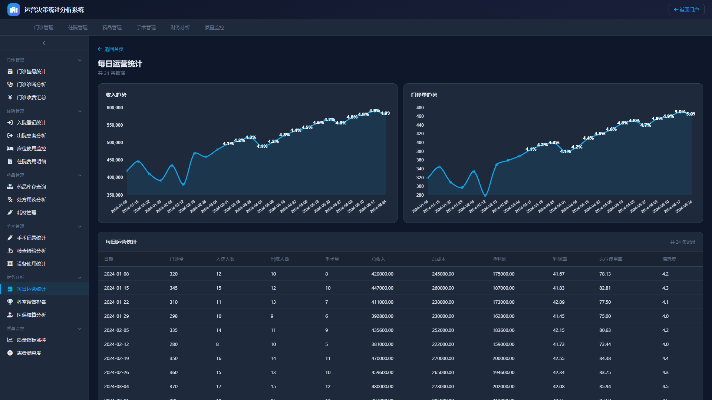
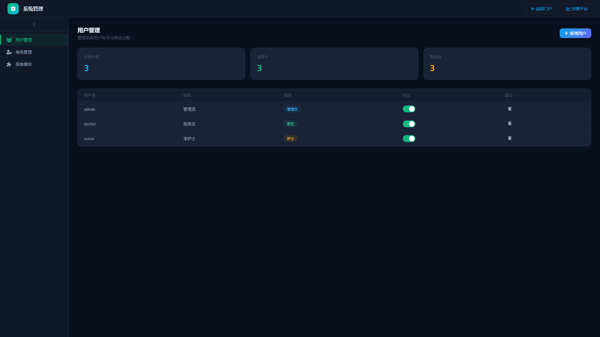

# 医疗运营数据决策平台

基于 Flask + MySQL + Chart.js 构建的医院运营数据决策分析系统（BS架构）。

## 功能模块

### 门户页
- 登录页（深蓝科技感风格）
- 门户页入口，可选择进入**决策平台**或**系统管理**

### 运营数据决策平台
- **仪表板**：8个核心指标卡片，数据从数据库实时查询
- **顶部导航**：门诊管理 / 住院管理 / 药品管理 / 手术管理 / 财务分析 / 质量监控
- **左侧菜单**：分组可收起/展开，点击切换报表
- **16个报表页面**：每个包含 Chart.js 图表（饼图/柱状图/折线图）+ 数据表格

### 报表清单

| 业务域 | 报表 |
|--------|------|
| 门诊管理 | 门诊挂号统计、门诊诊断分析、门诊收费汇总 |
| 住院管理 | 入院登记统计、出院患者分析、床位使用监控、住院费用明细 |
| 药品管理 | 药品库存查询、处方用药分析、耗材管理 |
| 手术管理 | 手术记录统计、检查检验分析、设备使用统计 |
| 财务分析 | 每日运营统计、科室绩效排名、医保结算分析 |
| 质量监控 | 质量指标监控、患者满意度 |

### 系统管理
- 用户管理（增删改、启用/禁用）
- 角色管理（管理员/医生/护士权限）
- 报表模块管理（三级树形结构，增删改查 + 确认提示框）

## 技术栈

| 层 | 技术 |
|----|------|
| 前端 | HTML + CSS + JavaScript + Chart.js |
| 后端 | Flask (Python) |
| 数据库 | MySQL (hospital_ops) |
| 截图 | Puppeteer + Edge |

## 快速开始

### 1. 安装依赖

```bash
pip install -r requirements.txt
```

### 2. 初始化数据库

确保 MySQL 已运行，导入 `hospital_ops` 数据库（24个表 + 4个视图）。

### 3. 启动服务

```bash
python app.py
```

访问 http://localhost:5000

### 4. 测试账号

| 用户名 | 密码 |
|--------|------|
| admin | admin123 |
| doctor | admin123 |
| nurse | admin123 |

## 项目结构

```
medical-platform/
├── app.py                  # Flask 后端
├── requirements.txt        # Python 依赖
├── templates/
│   ├── login.html          # 登录页
│   ├── portal.html         # 门户页
│   ├── dashboard.html      # 仪表板
│   ├── report.html         # 报表页面（含图表+表格）
│   ├── admin.html          # 系统管理
│   └── report_error.html   # 报表错误页
├── static/
│   ├── css/
│   └── js/
├── screenshots/            # 项目截图
│   ├── 1-portal.png
│   ├── 2-dashboard.png
│   ├── 3-report-outpatient.png
│   ├── 4-report-surgery.png
│   ├── 5-report-finance.png
│   ├── 6-portal-admin.png
│   └── 7-admin.png
└── README.md
```

## 数据库说明

`hospital_ops` 数据库包含 24 个表 + 4 个视图，覆盖：
- 患者、科室、员工等主数据
- 门诊（挂号/诊断/收费）
- 住院（入院/出院/费用/床位）
- 药品（目录/库存/处方）
- 手术与检查
- 财务运营统计
- 质量指标与绩效
- 设备、耗材、供应商

## 截图

### 门户页


### 仪表板


### 门诊挂号统计


### 手术记录统计


### 每日运营统计


### 系统管理

